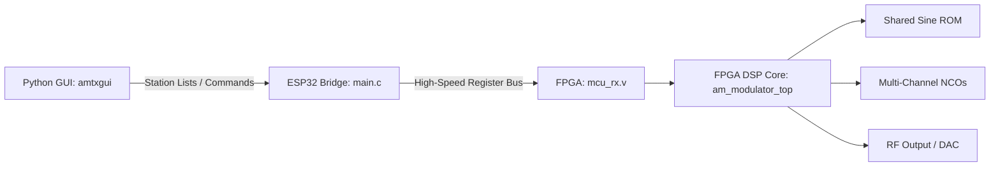

# AMWaveSynth (FPGA Edition) 📻⚡


An ultra-portable, massively scalable, full-stack Software-Defined Radio (SDR) Amplitude Modulation transmitter ecosystem. This repository contains the hardware-accelerated DSP core written in portable Verilog, an embedded ESP32 control bridge, and a responsive Python-based GUI for real-time station management.

By shifting from a pure software architecture to custom hardware pipelines, **AMWaveSynth** can synthesize up to hundreds of AM channels simultaneously, effectively replicating entire medium- and long-wave bands on a single low-cost chip.

---

## 🏗️ System Architecture

The ecosystem architecture is divided into three distinct layers, ensuring clean separation of concerns and maximum hardware agility:



1. **Frontend Tier (PC):** `fpga_amtxgui.py` provides an intuitive graphical interface to edit and dynamically stream curated station lists ("Senderlisten").
2. **Bridge Tier (ESP32):** `main.c` acts as the low-latency hardware interface, receiving data from the PC and translating it into fast register-write cycles for the FPGA.
3. **Hardware DSP Tier (FPGA):** Optimized, portable Verilog HDL modules handling high-speed phase accumulation (`nco.v`), resource-efficient wave synthesis (`shared_sine_rom.v`), and high-performance digital mixing (`am_modulator_top.v`).

---

## 📈 DSP Mathematics & Hardware Optimization

The hardware core performs digital double-sideband full-carrier amplitude modulation (DSB-FC) natively in logic gates:

s(t) = (1 + m * x(t)) * sin(2 * pi * f_c * t)

Where `x(t)` represents the baseband audio/signal generated by the multi-channel NCO array, `m` is the modulation index, and `f_c` is the synthesized carrier frequency.

### Resource-Saving Highlight: Time-Shared Sine ROM
Instead of instantiating individual Lookup Tables (LUTs) or Block RAMs (BRAM) for every single broadcast channel, `shared_sine_rom.v` implements a time-multiplexed/shared architecture. This allows multiple NCO pipelines to cycle through the same memory resource within a single clock domain, drastically cutting down memory utilization.

---

## 📊 Hardware Utilization & Massive Scalability

The Verilog design is purely synchronous, vendor-independent, and highly portable. It scales seamlessly from obsolete educational boards to modern hobbyist hardware.

### Benchmark: Very first 4-Channel Design on Legacy Hardware
Below are the compilation results using Intel Quartus II for an ancient, budget-friendly **Altera Cyclone II (EP2C5)** FPGA:

| Resource Metric | Used | Available | Percentage |
| :--- | :--- | :--- | :--- |
| **Total Logic Elements (LEs)** | 557 | 4,608 | **12%** |
| **Total Combinational Functions** | 460 | 4,608 | **10%** |
| **Dedicated Logic Registers** | 415 | 4,608 | **9%** |
| **Total Memory Bits (BRAM)** | 32,768 | 119,808 | **27%** |
| **Embedded Multiplier 9-bit Elements** | 8 | 26 | **31%** |
| **Total PLLs** | 0 | 2 | **0%** |

### Projected Channel Scaling Estimates
Thanks to the lean logic footprint, the channel density scales incredibly well depending on your target platform and optimization techniques:

10ch - Tech-demo on ancient Cyclone II Series , longwave and mediumwave with different att/gain settings


* **Legacy Hardware (e.g., Cyclone II EP2C5 Series):**
  * **12–13 AM channels** comfortably without any advanced time-multiplexing tricks.
  * **16–24 AM channels** utilizing structural time-multiplexing on basic configurations.
* **Modern Hobbyist Hardware (e.g., Sipeed Tang Nano 25k):**
  * **50–60 AM channels** running completely in parallel out-of-the-box.
  * **200+ AM channels** with optimized time-multiplexing pipelines — **enough to synthesize a complete medium- and long-wave broadcast band simultaneously!**

---

## 📁 Repository Structure

```text
FPGA_AMWaveSynth/
│                           # FPGA Logic (Portable Verilog HDL)
├── am_modulator_top.v      # Top-level entity & AM mixing logic
├── nco.v                   # Numerically Controlled Oscillator core
├── shared_sine_rom.v       # Resource-optimized, time-shared Sine ROM
├── mcu_rx.v                # Microcontroller register bus interface
├── debouncer.v             # Glitch-filtering for hardware buttons
├── mcu_examples/           
│   └── esp32/              # ESP32 Bridge Source Code # Low-latency PC-to-FPGA communication
│        └── mcu_tx/        # ESP32 to FPGA Parallel Stream Interface test 10ch - AM with 10 internal sinus gen, TB Espressif QEMU 
│        └── udp_rx_mcu_tx/ # Low-latency PC-to-ESP32 / UDP-to-FPGA AM Radio Bridge, implements a bridge between real IP networks (Internet Radio,ffmeg) and an FPGA. 
│   
├── amtxgui/                    # Desktop Control Application
│   └── fpga_amtxgui.py         # Python GUI for transmitter curation
└── README.md                   # Project Documentation
```

---

## 🌌 Closed-Loop Ecosystem Simulation

This hardware synthesis core is designed to work hand-in-hand with its sister project:
🔗 **[AMWaveSynthPropagationSimulator](https://github.com/radiolab81/AMWaveSynthPropagationSimulator)**

While this repository generates real-time, high-precision RF signals in physical hardware, the **PropagationSimulator** allows you to ingest these virtual station arrays, simulating and visualizing how your synthesized radio waves interact with real-world, ionospheric conditions, and synthetic environments. Together, they form a comprehensive, end-to-end digital radio engineering laboratory.

---

## 🛠️ Getting Started

### Prerequisites
* **FPGA Toolchain:** Intel Quartus (for Altera/Intel), Xilinx/AMD Vivado, or Yosys/NextPNR (for open-source toolchains like Tang Nano).
* **ESP32 Environment:** ESP-IDF 6.1
* **Python Environment:** Python 3.x

### Deployment
1. **Flash the FPGA:** Open the project in your respective IDE, set `am_modulator_top` as the top-level entity, assign your board's clock/pins, and synthesize.
2. **Flash the ESP32:** Compile and upload `/mcu_examples/esp32/udp_rx_mcu_tx/main.c` to your bridge microcontroller. Connect the designated GPIO pins to the FPGA's register input interface.
3. **Launch the Controller:** Run `python amtxgui/fpga_amtxgui.py` to start managing your radio spectrum in real time!

### Still to do:
 * Direct Ethernet support (without need for external mcu), W5100 / W5500 or similar, Softcore ...
 * Evaluation of performance across multiple FPGA development boards
 * Recording of RF data to SD or USB mass media, directly on the board
 * Sferics emulation
 * ...
