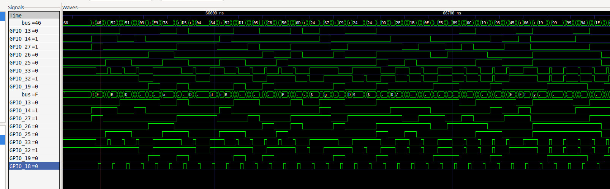
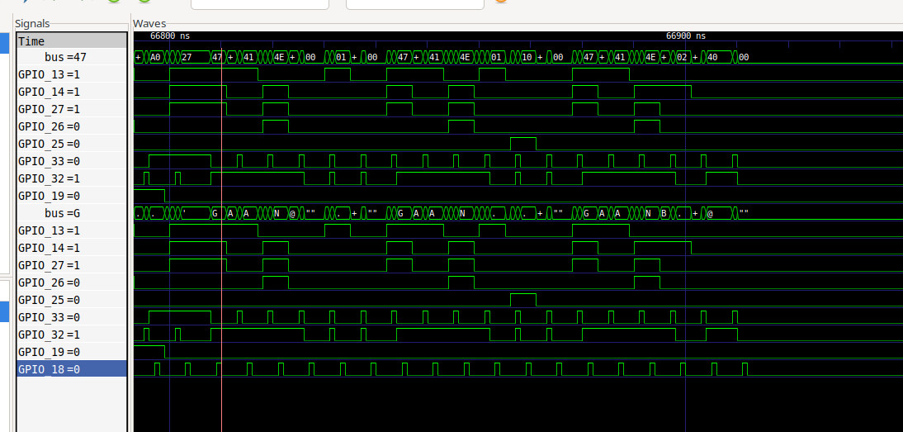
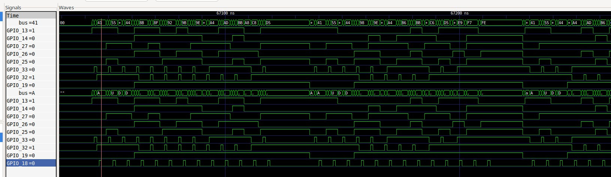

# ESP32 to FPGA Parallel Stream Interface

This provides an EMI-hardened reference implementation for streaming multi-channel 8-bit PCM audio data from an ESP32 microcontroller to an FPGA or custom digital logic pipeline (e.g., Verilator testbenches) over an asynchronous parallel bus.

The project demonstrates the complete engineering cycle: from bare-metal register optimizations on the ESP32 to virtual verification using **Espressif QEMU (`esp-develop-9.2.2`)**, trace logging parsing via Python into standard Value Change Dump (`.vcd`) formats, and waveform verification using GTKWave.

## 🚀 Key Features

* **Multi-Channel Streaming**: Continuous 25 kHz streaming of 10 independent audio channels (8-bit PCM) alongside configuration command routing.
* **Atomic Bit-Slicing**: Avoids slow pin-by-pin execution loops by driving the ESP32 hardware register structures (`GPIO.out_w1ts` / `GPIO.out_w1tc`) simultaneously across Bank 0 and Bank 1.
* **EMI & Jumper-Wire Hardened**: Implements precise ns Setup, Strobe, and Hold phase profiles via hardware-inlined delays (`esp_cpu_get_cycle_count`), matching real-world transmission requirements over loose prototyping wiring.
* **Dual-Core Architecture**: Isolates the time-critical audio synthesizer pipeline entirely on ESP32 **Core 1** using FreeRTOS task pinning to completely eliminate kernel scheduler jitter.
* **Virtual Verification Stack**: Fully verified without physical hardware by intercepting QEMU memory operations mapping (`memory_region_ops_write`) and translating raw logs into pristine `.vcd` trace files.

---

## 📐 Interface Protocol Architecture

The physical interface uses an 8-bit wide parallel data bus matched with a single source-synchronous data validation strobe line (`PIN_DATA_EN`).

### Byte Transaction Waveform Profile
```text
               +-------------------+
DATA_BUS       |    Gültige Daten  |
        -------+-------------------+-------
                     +-------+
PIN_DATA_EN          |       |  (Trigger Rising-Edge)
        -------------+       +-------------
        < -200ns ->   -200ns -> -200ns Hold ->
```

1. **Setup Phase (200 ns)**: The 8-bit data is driven onto the bus while the Strobe line stays explicitly at `0`. This allows the parasitics and capacitance of standard jumper wires to settle down completely.
2. **Strobe Phase (200 ns)**: `PIN_DATA_EN` pulses high. On the receiving FPGA end, this signal travels safely through a 3-FF metastable synchronizer and a 4-tap digital glitch filter, triggering the protocol Finite State Machine (FSM) reliably.
3. **Hold Phase (200 ns)**: `PIN_DATA_EN` drops low while the driven state stays locked on the bus, ensuring zero hold-time violations internally inside the sync logic of the FPGA module.

### Framing Protocols (Layer 2)

The receiving hardware FSM handles three distinct data streaming frames based on a 3-byte ASCII command prefix sequence:

* **Audio Stream Frame (`"AUD"`)**: Transmits a 13-byte burst consisting of the `"AUD"` header followed by 10 linear 8-bit PCM audio samples. Driven in a precise 4 µs window to lock in a exact 25 kHz sample rate loop.
* **Frequency Configuration Frame (`"FRQ"`)**: Transmits a 43-byte configuration array containing a 3-byte header and 10 individual 32-bit Phase Increment NCO Tuning words (Big-Endian/MSB First). Called during initialization.
* **Gain / Volume Adjustment Frame (`"GAN"`)**: Transmits a 6-byte sequence containing the `"GAN"` header, a single channel target byte (`0` to `9`), and a 16-bit Master Gain Coefficient (Big-Endian/MSB First).

---

## 🛠️ Verification & Emulation Setup

The interface was virtually simulated and performance-verified using the official Espressif QEMU environment without relying on external hardware testing instrumentation.

### 1. Generating Simulation Memory Traces
The project is built inside the modern **ESP-IDF v6.1** development environment. QEMU is directed to track internal memory operations mapped directly to the ESP32 GPIO peripherals space (`0x3ff44000`) by executing:

```bash
# 1. Arm target to catch peripheral write calls
echo "memory_region_ops_write" > trace_events.txt

# 2. Compile and launch headless emulation streaming to target file
idf.py build qemu --qemu-extra-args="-trace events=trace_events.txt,file=qemu_gpio_trace.log"
```

### 2. Log-to-VCD Conversion
Because QEMU dumps trace events as standard line strings, a custom Python converter (`log_to_vcd.py`) intercepts the underlying register writes (`GPIO_OUT_REG`, `GPIO_OUT_W1TS_REG`, `GPIO_OUT_W1TC_REG`) and maps the relative sequencing blocks into highly compressed standard `.vcd` files ready to view.

---
### 📋 Prerequisites for Linux (Debian 13 / Ubuntu)
The pre-compiled QEMU binary provided by Espressif requires specific host shared libraries (like `libslirp`) to bypass environment validation errors during setup. 

Before installing the toolchain extensions, ensure all native system dependencies are resolved:

```bash
# 1. Install missing network and emulation shared libraries
sudo apt-get update
sudo apt-get install -y libgcrypt20 libglib2.0-0 libpixman-1-0 libsdl2-2.0-0 libslirp0

# 2. Trigger the official Espressif QEMU-Xtensa engine installation
python3 \$IDF_PATH/tools/idf_tools.py install qemu-xtensa

# 3. Refresh environment variables for your current terminal session
. \$IDF_PATH/export.sh
```


## 📊 Emulation Waveform Analysis

The following simulation outputs captured from **GTKWave** verify the exact matching behavior between the ESP32 transmitter code and the corresponding hardware FSM.

### 1. Multi-Channel Frequency Control Initialization (`"FRQ"`)
During the power-on boot sequence, `app_main` transmits the initial multi-channel DDS carrier parameters.



* **VCD Trace Catch**: The waveform captures the explicit sequential conversion layout of ASCII character markers `f`, `R`, and `Q`. 
* **Data Inspection**: The underlying data buses correctly capture the Big-Endian transmission sequences for Channel 0 (Hex `03` `E9` `78` `D5`), Channel 1 (Hex `04` `64` `52` `D1`), and downstream profiles matching the target testbench parameters flawlessly.

### 2. Digital Gain & Preamplifier Updates (`"GAN"`)
Directly following the channel configuration block, the code exercises target gain adjustments across the audio channels.



* **VCD Trace Catch**: Captures successive `"GAN"` control headers followed by targeting identifiers.
* **Verification**: Confirms exact variable distribution across specific registers (e.g., target `00` loading gain value `0100`, target `01` loading `1000`, and target `02` loading `4000`), matching precise attenuation controls.

### 3. Continuous Multi-Channel Audio Stream Real-Time Runtime (`"AUD"`)
Once execution enters the main real-time operational window, the system switches to highly repeating data packet transfers.



* **VCD Trace Catch**: Captures the recurring `"AUD"` validation sequence firing at perfectly balanced interval ticks.
* **Glitch Elimination**: The zero-jitter parallel bit change transition validates the atomic structural assignment via the `GPIO` structure. No ghosting fragments or intermediate invalid data flags occur during execution loops.
* **Audio Synthesis Verification**: The consecutive payload byte arrays show true arithmetic step progressions coming out of the dual-core 16-bit fixed-point phase accumulator, ensuring glitch-free playback streams on the analog modulator outputs.
